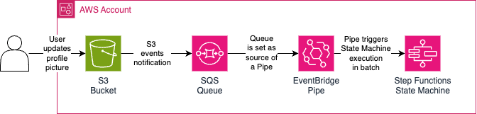
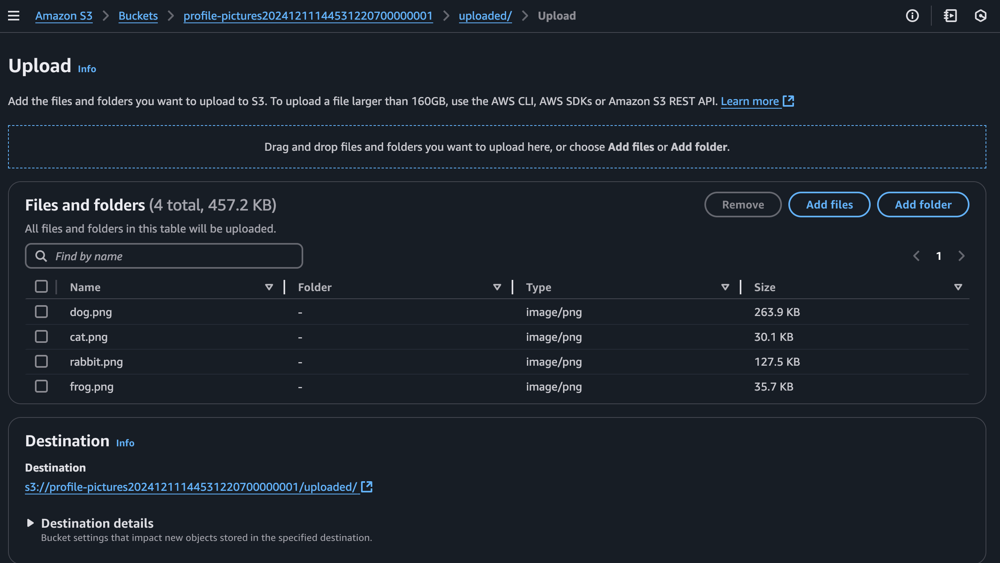
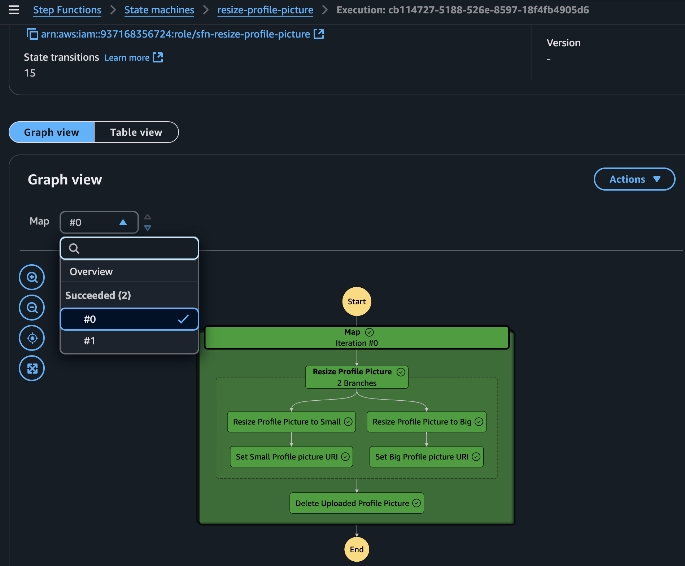
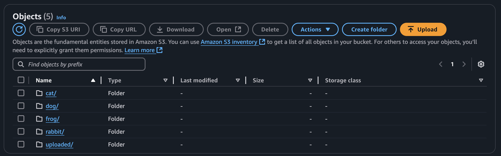
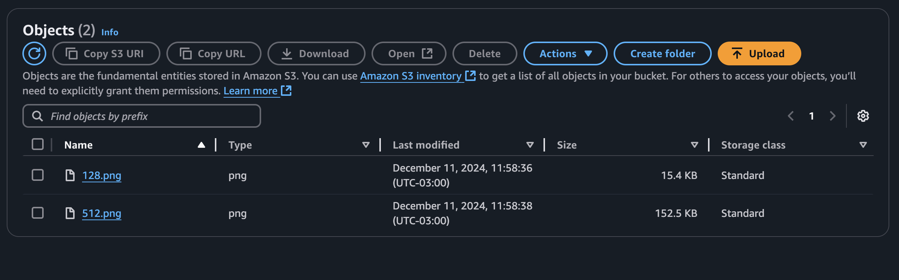
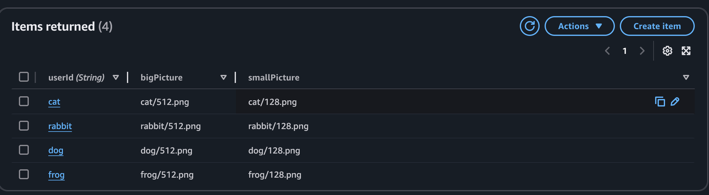

# step-functions

This is a demo repository for my [personal blog article](https://felipetrindade.com/step-functions). It contains four (4) Step Function exercises. Go ahead and explore them:
- `should i deploy`: Basic example of the capabilities of Step Functions
- `create new user`: Explores Task Token states (manual approval)
- `bucket replication`: Explores the Pooling pattern for async jobs
- `resize image`: A closer "real-world" example.

This README will focus on the later exercise. You can check each exercise, their own README, and documentation.

I highly encourage the reading of my blog post for deep explanation.

## Resize Image: Profile picture resizer
The goal of the code provided here is to provision a basic infrastructure responsible for resizing profile pictures to use as thumbnails in different parts of a website: small and big sizes.

When a user uploads a new profile picture the provided code created here will:
- Download the profile picture from S3
- Resize using the Pillow Python library
- Store the resized images in S3
- Update DynamoDB tables with the corresponding S3 object key
- Delete the original (uploaded) profile picture from S3

The `upload` process will be done manually via AWS Console but in a real-world scenario, a secure, scalable, and recommended way to deal with uploads is via [Presigned URLs](https://docs.aws.amazon.com/AmazonS3/latest/userguide/PresignedUrlUploadObject.html) that can be generated by your backend/API.

## Infrastructure
Terraform provides the infrastructure for this project.



The Step Function is responsible for orchestrating the entire logic described in the `Profile picture resizer` section.


## Running this project
The only dependency needed to start using this project is [Devbox](https://www.jetify.com/devbox) and [Nix](https://nixos.org/download/) (if you install Devbox first it will install Nix for you if you don't have it), all the other tools will be installed by it. Make sure your AWS region was already CDK bootstrapped.

1) Export AWS credentials and region (`AWS_REGION`) environment variables

2) Install dependencies

```sh
devbox shell
```

3) Initialize Terraform

```sh
terraform init
```

4) Deploy Terraform

```sh
terraform apply
```

5) Upload PNG to S3 bucket

Upload `png` files with the prefix `uploaded` (e.g. `uploaded/dog.png`) to the created S3 bucket (the prefix name of the bucket is `profile-pictures`).



6) Check results

You can check the step function executions should be successful. Some of the profile pictures were parallelized and executed in the same Step Function execution, others were executed in a single Step Function execution.



Now you should see the S3 bucket with the PNG files created for each user.





We can also check the DynamoDB table results.



7) Are you done? Let's delete the infrastructure created!

First, clean up all the files in the S3 bucket and then run the following:

```sh
terraform destroy
```